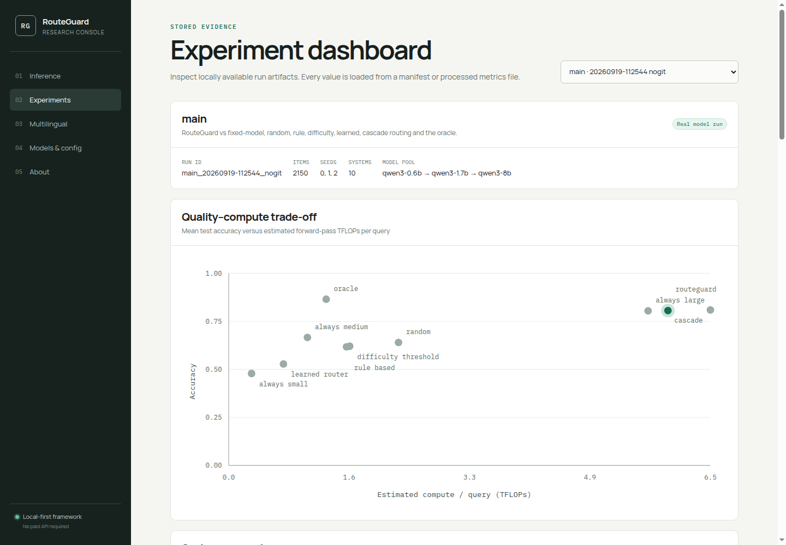
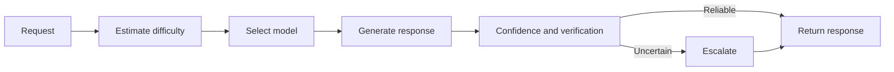

# RouteGuard-LLM

**Reliable, cost-aware routing for multi-model LLM applications.**

[](https://github.com/Are1V/RouteGuard-LLM/actions/workflows/ci.yml)


RouteGuard selects the right model for each request, checks the reliability of the response, and
escalates uncertain answers to a stronger strategy. It includes a Python CLI, FastAPI service,
Next.js dashboard, evaluation tools, and support for local or OpenAI-compatible model servers.

<p align="center">
  
</p>

## Features

- Routes requests by difficulty, expected quality, and cost.
- Calibrates confidence and verifies structured, arithmetic, code, and grounded answers.
- Escalates uncertain responses through stronger models, retrieval, tools, or self-consistency.
- Tracks latency, tokens, cost, compute, and complete decision traces.
- Supports Hugging Face models and OpenAI-compatible APIs such as vLLM, Ollama, and llama.cpp.
- Includes multilingual evaluation for English, Kazakh, Russian, Persian, and Dari.

## How it works



## Quick start

Requirements: Python 3.11 or 3.12, Node.js 20+, and npm.

```bash
git clone https://github.com/Are1V/RouteGuard-LLM.git
cd RouteGuard-LLM

python -m venv .venv
source .venv/bin/activate
pip install -e ".[dev,api]"

cd apps/web
npm ci
cd ../..

./scripts/run_web.sh
```

Open:

- Web interface: [http://127.0.0.1:3000](http://127.0.0.1:3000)
- API documentation: [http://127.0.0.1:8000/docs](http://127.0.0.1:8000/docs)

The default configuration uses a simulator, so the application starts without downloading a
model. Simulated output is clearly labelled in the interface.

## CLI

```bash
# Run a sample request
routeguard run

# Run the smoke benchmark
routeguard benchmark --config experiments/smoke/smoke.yaml

# Inspect available components
routeguard components

# Launch the optional Gradio trace viewer
pip install -e ".[dashboard]"
routeguard demo
```

Use a real local model:

```bash
pip install -e ".[hf]"
routeguard run \
  --config configs/local_hf.yaml \
  --query "What is 17 multiplied by 23?" \
  --answer-type numeric
```

For an OpenAI-compatible server, copy [`.env.example`](.env.example), configure
[`configs/openai_compatible.yaml`](configs/openai_compatible.yaml), and keep API keys in
environment variables.

## Configuration

RouteGuard is configured with YAML. Ready-to-use examples are available in:

- [`configs/demo.yaml`](configs/demo.yaml) — simulator for local development
- [`configs/local_cpu.yaml`](configs/local_cpu.yaml) — local CPU inference
- [`configs/local_hf.yaml`](configs/local_hf.yaml) — local Hugging Face models
- [`configs/openai_compatible.yaml`](configs/openai_compatible.yaml) — compatible HTTP APIs

## Documentation

- [Architecture](docs/architecture.md)
- [Model routing](docs/routing.md)
- [Confidence and calibration](docs/confidence.md)
- [Escalation](docs/escalation.md)
- [Benchmarking](docs/benchmarks.md)
- [Reproducibility](docs/reproducibility.md)
- [Published evaluation results](docs/results/README.md)
- [Cluster execution](docs/cluster.md)

## Development

```bash
pytest
ruff check .
mypy

cd apps/web
npm run lint
npm run typecheck
npm test
npm run build
```

The public API does not expose shell commands, filesystem paths, environment variables, or the
benchmark code runner. The optional subprocess verifier is intended for controlled evaluation
only and is not a security sandbox.

## Status

RouteGuard-LLM is alpha software. Interfaces may change before version 1.0. Real-model performance
depends on the selected models, datasets, hardware, and configuration.

## License

Licensed under the [Apache License 2.0](LICENSE).
