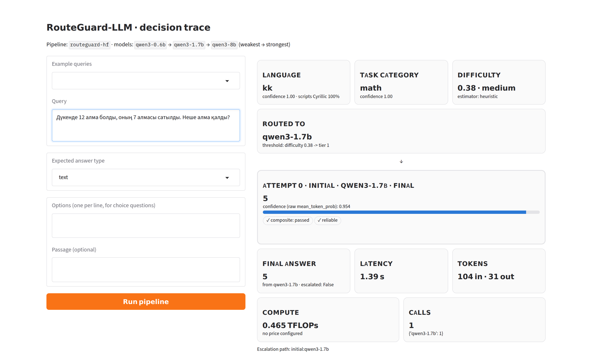

# Dashboard

An interactive view of one query's decision trace: detected language, task category and
difficulty; the routed model; every attempt with its confidence (raw or calibrated) and verifier
verdict; the escalation path; and latency, tokens, compute and the number of calls per model.
There is no conversation and no hidden state — the point is to make one routing decision legible.



```bash
pip install -e ".[dashboard]"
routeguard demo                                  # simulated backend, no downloads
routeguard demo --config configs/local_hf.yaml   # real local models (GPU)
python dashboard/app.py configs/local_cpu.yaml   # equivalent launcher script
```

The implementation lives in `routeguard/dashboard.py`, so `routeguard demo` works after
installation. Pipelines with learned components (learned difficulty or routers) must be fitted
on data first; use `routeguard benchmark` for those.

With the simulated backend every trace is labelled as simulated: the backend's answers are drawn
from a probability model, not generated by a language model, and a free-typed query it has no
reference for will show "no answer extracted".
