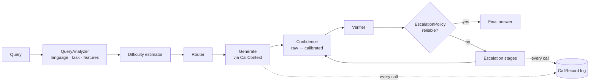
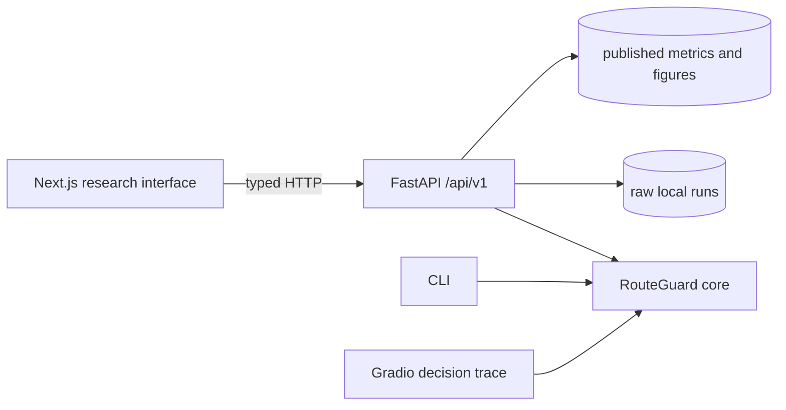

# Architecture

RouteGuard is a pipeline of small components with one job each, glued together by
`routeguard/pipeline.py`. Every component is chosen by name in YAML and built from a registry,
so experiments never require code changes.

## Package layout

| Module | Responsibility |
|---|---|
| `types.py` | Plain dataclasses for every intermediate result (`Query`, `Attempt`, `PipelineResult`, ...) |
| `config.py` | Validated pydantic schema; `extends:` inheritance; system overrides |
| `context.py` | `CallContext`: the only place model calls happen; records cost; gates gold references |
| `prompts.py`, `answers.py` | Prompt assembly and answer extraction/canonicalisation |
| `analysis/` | Language identification, task classification, query features, vectorisation |
| `complexity/` | Difficulty estimators (heuristic, learned, neural, LLM judge) and difficulty targets |
| `router/` | Fixed, random, rule, threshold, learned, cost-aware, quality-cost, oracle routers |
| `models/` | `BaseLLM`, backends (simulated, Hugging Face, OpenAI-compatible), `ModelPool`, generation cache |
| `confidence/` | Log-prob and sampling estimators, calibrators, risk-controlled thresholds |
| `verification/` | Format, arithmetic, code-execution, grounding, and judge verifiers |
| `escalation/` | Trigger policy and stages (re-prompt, stronger model, retrieval, self-consistency, judge, tool) |
| `rag/` | BM25 retriever and retrieval-vs-generation reliability evaluation |
| `tools/` | Deterministic tools, text-protocol tool agent, tool-use failure taxonomy |
| `benchmarks/` | Item schema, dataset loaders, group-aware splits |
| `evaluation/` | Scoring, metrics, calibration metrics, statistics, error analysis, tables, figures, report |
| `experiments/runner.py` | The benchmark protocol (splits → fit → profile → evaluate → report) |
| `tracking/` | Versioned run directories, manifests, JSONL writers |
| `cli.py`, `dashboard.py` | Command line and interactive demo |

## Application boundary

The optional applications depend on the core package; the core never imports them. `apps/api`
wraps `RouteGuardPipeline` in versioned FastAPI routes and provides read-only access to experiment
artifacts. `apps/web` is a Next.js client of that API. Routing, calibration, verification, and
cost accounting remain in Python.

Ad-hoc requests may select only repository configurations discovered under `configs/`. The API
does not accept arbitrary configuration or artifact paths, expose environment variables, or run
experiments. It also removes the benchmark-only `code_execution` verifier: the resource-limited
subprocess is not a security boundary. Recent inference traces are held in a bounded in-memory
store; raw experiment records remain local and git-ignored. Published
`docs/results/*/metrics.json` files let a fresh clone serve the verified dashboard summaries
without including per-example model outputs.

## Key design decisions

**All model calls go through `CallContext`.** Difficulty judges, confidence samples, verifier
judges and escalation stages all spend tokens. Routing is only compared fairly if every call is
charged, so no component can reach a backend directly. `PipelineResult.calls` lists each call
with its purpose, tokens, latency, USD cost, and estimated FLOPs.

**Gold data never reaches decision components.** Benchmark items carry gold answers in
`Query.reference`. `CallContext` forwards that field only to backends with
`requires_reference = True`, which is only the simulator. Evaluation-time diagnostics that need
gold data are computed in `evaluation/records.py` after the pipeline has answered, for example
whether the gold answer appeared in the retrieved evidence.

**N models, not three.** The pool is an ordered list. Tiers, `next_stronger`, threshold
partitions, the oracle, and all metrics work for any number of models.

**Generation cache.** Requests are keyed by backend identity plus the full request, and stored
in SQLite with the latency and token counts measured when they were generated. Ten systems ×
three seeds re-use the same generations, and replayed runs report real costs.

**Raw vs calibrated confidence.** `ConfidenceResult.raw` is an estimator score.
`ConfidenceResult.calibrated` is an estimate of P(correct) fitted on a held-out calibration split.
Metrics report which one was used (`rel_calibrated_fraction`).

**Simulated backend.** It exists only to test the plumbing without downloads. It reads the gold
answer and is therefore *not* a model. Manifests, records, tables, and figures from simulated
runs are all marked.
